# 1. 背景及选题介绍

## 1.1 语言及背景介绍

SysY 语言是 C 语言的一个简化子集，SysY2022 语言是 SysY 语言的 2022 年版本，在基本语法上与 C 语言保持一致，但它仅支持有限的功能集。

RISC-V 是一种开放标准的指令集架构，最初由加州大学伯克利分校的一个团队开发。与一些商用指令集不同，RISC-V 是开放和免费使用的。RISC-V 的指令集非常精简，如浮点运算、向量处理和虚拟化。

我们选择 RISC-V 作为我们的目标硬件平台，使用 C++ 作为编程语言进行编译器的开发。

## 1.2 人员分工

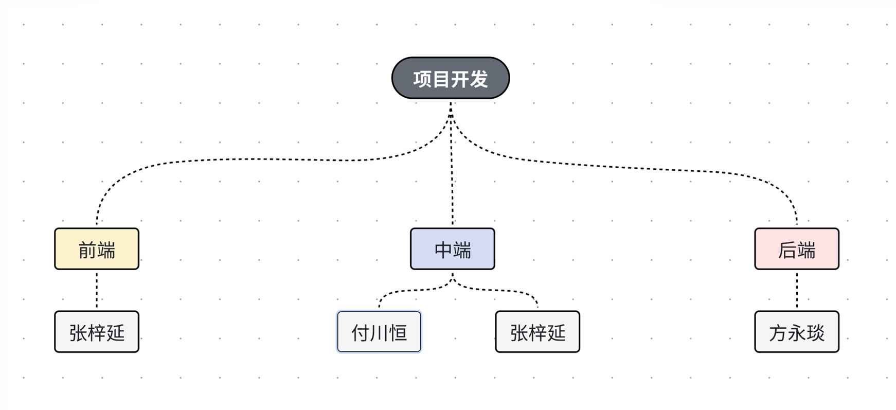

## 1.3 时间分配

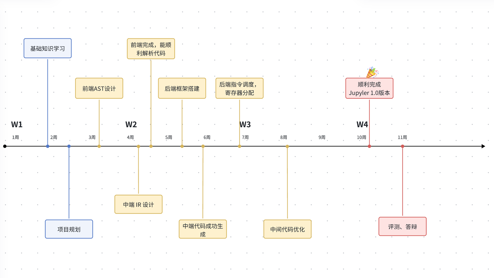

## 1.4 人员贡献

TODO：

# 2. 系统设计分析

我们编译器的系统主要分为**前端、中端、后端**三层架构，接下来从这三个层次来进行分析。

## 2.2 前端

在前端我们使用了 ANTLR4 作为我们的语法分析器。ANTLR（ANother Tool for Language Recognition）是一个强大的语法分析器生成工具，用于从语法描述中自动生成解析器、词法分析器、语法树和访问器。它支持多种编程语言的目标代码生成，包括 Java、C++、Python 等。

根据 SysY2022 的语言定义，我们设计了文法规则 SysY.g4，在词法分析、语法分析后，使用 Visitor 模式来解析输入流并构建 AST。

AST 的主要类：`Node`（所有 AST 节点的基类）、`Stmt`（语句，在文法中以分号 `;` 结束）、`Expr`（表达式，包括左值右值、取数组值、单目运算、双目运算、函数调用、字面值）。

AstVisitor 构建 AST 时：

-   `visitDecl` 负责处理变量和常量的声明，依次访问 `ConstDecl` 和 `VarDecl`，将它们转换为 AST 中的 `DeclStmt` 节点。
-   初始化值（单一或复合）通过 `visitSingleInitVal` 和 `visitMultiInitVal` 方法进行处理，构建 `InitExpr` 节点。
-   `visitFuncDef` 负责处理函数定义，构建 `Function` 节点，并处理函数的形参列表和函数体（`BlockStmt`）。
-   `visitFuncFParam` 和 `visitFuncRParams` 方法用于处理函数形参和实参。
-   各种语句（如赋值语句、表达式语句、条件语句等）都有对应的访问方法（如 `visitAssignStmt`、`visitIfStmt` 等），这些方法将解析树节点转换为 AST 中的相应语句节点。
-   不同类型的表达式（如一元、二元、逻辑、条件表达式、字面值等）通过各自的访问方法进行处理，并转换为相应的 AST 节点（如 `UnaryExpr`、`BinaryExpr` 等）。
-   通过重载 `visit` 方法，`AstVisitor` 根据解析树的不同节点类型，动态调用相应的访问方法。

## 2.3 中端

### 2.3.1 中间代码（IR）

#### 2.3.1.1 中间代码分析

在 AST 上进行初步的语义分析、类型推断后，可利用一趟深度优先遍历，由 AST 生成 IR。

IR的设计我们参考了开源项目LLVM，我们以图的形式来组织中间代码，层次分为模块、函数、基本块、语句，其中基本块及连接基本块的边构成控制流图（CFG），每个基本块内部的指令、操作数等元素构成有向无环图（DAG）。我们将 IR 中的变量称为虚拟寄存器（`ir::Register`），变量和常量统称为值（`ir::Value`），每种值都具有一个数据类型（`DataType`）。因为数据类型等信息保存在对象中，所以在生成 IR 之后，我们就不需要符号表了。

这些图中的点和有向边具有一些共同的属性，比如源、目标、附加信息等，还应该支持一系列共通的图操作，比如删点（可见于 `GraphNode::remove`）、插入点（可见于 `GraphNode::insertAfter` 等）、重定向边（可见于 `CFGEdge::redirectDest`）等，所以我们将这些功能整合到泛型基类中，尽可能使这些代码可重用。

在设计之初，我们的 IR 与 AST 过于相似。后来参考了三地址码的格式，在保持有向图的形式的基础上，减小了 IR 与目标代码的距离，使得目标代码生成更加便捷。同时，在输出 IR 时，我们有意参照了 LLVM IR 的输出格式，这样可以结合 VSCode 的 LLVM IR 语法高亮插件，以便调试。

#### 2.3.1.2 中间代码架构解释

我们的中端架构如下：

```
.
├── README.md
├── analyses
│   ├── CFA.cpp
│   ├── CFA.h
│   ├── DFA.cpp
│   ├── DFA.h
│   ├── LoopDetection.cpp
│   ├── LoopDetection.h
│   ├── LoopIndVar.cpp
│   ├── LoopIndVar.h
│   ├── LoopIndVarAnalysis.cpp
│   ├── LoopIndVarAnalysis.h
│   ├── LoopInvariantAnalysis.cpp
│   ├── LoopInvariantAnalysis.h
│   ├── PureFunctionAnalysis.cpp
│   ├── PureFunctionAnalysis.h
│   ├── UseDefAnalysis.cpp
│   └── UseDefAnalysis.h
├── ir
│   ├── Builder.h
│   ├── CFG.cpp
│   ├── CFG.h
│   ├── DAG.cpp
│   ├── DAG.h
│   ├── Expr.cpp
│   ├── Expr.h
│   ├── Graph.cpp
│   ├── Graph.h
│   ├── IR.h
│   ├── IRToString.cpp
│   ├── Instruction.cpp
│   ├── Instruction.h
│   ├── README.md
│   ├── Scopes.cpp
│   ├── Scopes.h
│   ├── Values.cpp
│   └── Values.h
├── legacy
│   ├── ExpHoisting_legacy.cpp
│   ├── ExpHoisting_legacy.h
│   ├── LICM_legacy.cpp
│   ├── LICM_legacy.h
│   ├── LoopUnrolling_legacy.cpp
│   ├── LoopUnrolling_legacy.h
│   ├── RLELocal_legacy.cpp
│   ├── RLELocal_legacy.h
│   ├── SSA_legacy.cpp
│   └── SSA_legacy.h
├── transforms
│   ├── CFGSimplify.cpp
│   ├── CFGSimplify.h
│   ├── CSE.cpp
│   ├── CSE.h
│   ├── ConstFold.cpp
│   ├── ConstFold.h
│   ├── CopyProp.cpp
│   ├── CopyProp.h
│   ├── DCE.cpp
│   ├── DCE.h
│   ├── FuncInline.cpp
│   ├── FuncInline.h
│   ├── GEP2Add.cpp
│   ├── GEP2Add.h
│   ├── IRPasses.cpp
│   ├── IRPasses.h
│   ├── InstCombine.cpp
│   ├── InstCombine.h
│   ├── LICM.cpp
│   ├── LICM.h
│   ├── LoopRotate.cpp
│   ├── LoopRotate.h
│   ├── LoopStrengthReduce.cpp
│   ├── LoopStrengthReduce.h
│   ├── Mem2Reg.cpp
│   ├── Mem2Reg.h
│   ├── SSADestruct.cpp
│   ├── SSADestruct.h
│   ├── StoreProp.cpp
│   ├── StoreProp.h
│   ├── StrengthReduce.cpp
│   ├── StrengthReduce.h
│   ├── TailRecurElim.cpp
│   └── TailRecurElim.h
└── utils
    ├── IRUtils.cpp
    └── IRUtils.h
```

- `analyses`存放DFA、CFA、LoopDetection等模块的代码。
- `ir`中存放我们的IR结构，包括DAG、CFG等。
- `legacy`存放待删除的无用代码。
- `transforms`中存放可以优化IR的Pass，是IR优化的关键所在。

### 2.3.2 中端优化

除了表示中间语言和用于生成机器指令，IR 的一大职责是为一系列机器无关优化提供方便。以下为我们在 IR 上进行的一部分主要优化：

#### 2.3.2.1 Mem2Reg

> sysy-compiler/src/midend/transforms/Mem2Reg

我们初步生成的 IR 中，变量在声明时会产生一条 alloca 指令（`ir::AllocInst`），而赋值和取值分别会使用 store（`ir::StoreInst`）和 load（`ir::LoadInst`）来实现。在这种 IR 的基础上，Mem2Reg 在 SSA（静态单赋值）形式的前提下，将访存操作替换为 move（`ir::MoveInst`）等，对多次赋值的变量进行重命名，并在必要的地方（控制流分析得到的支配边界）插入 phi 节点（`ir::PhiInst`，在我们的设计中 phi 的源值并非保存在这条指令中，而是保存在所在基本块的入边中，这样可以极大地简化控制流图的修改，减少需要维护 phi 函数一致性的次数，这或许和 MLIR 中的 SSA 思想类似）。

#### 2.3.2.2 复制传播

> sysy-compiler/src/midend/transforms/CopyProp

在 SSA 形式的 IR 中，复制传播变得非常简单。由于每个变量只有一次赋值，我们可以直接将复制指令中出现的目标变量全局替换为源变量。这就完成了一趟复制传播。

#### 2.3.2.3 常量折叠

> sysy-compiler/src/midend/transforms/ConstFold

在我们的中端，常量折叠和复制传播配合使用。具体来说，常量折叠会产生复制指令，而复制传播会将折叠后的常量传播到对应的地方，也就提供了新的常量折叠的可能。所以，我们将这两个 pass 交替进行，直到没有新的修改为止。

#### 2.3.2.4 死代码消除

> sysy-compiler/src/midend/transforms/DCE

通过求解活跃变量的数据流方程，我们可以得到每个基本块入口和出口处的活跃变量集。对基本块内的指令拓扑排序，再反向遍历该拓扑序列，统计每个变量在当前位置之后被取值的次数。当一条指令定值的变量既不在基本块出口处活跃，又没有在当前基本块中当前位置之后被取值时，这条指令就可以判定为死代码并进行删点操作。

#### 2.3.2.5 控制流图简化

> sysy-compiler/src/midend/transforms/CFGSimplify

在上述的优化进行之后，IR 有可能被化简许多，这也就产生了许多潜在的控制流优化空间。比如，在死代码消除后出现的空基本块可以通过删点和合并边的操作来移除；在常量折叠和复制传播后出现的永真式、永假式条件跳转可以简化为无条件跳转，从而可能产生不可达基本块，我们可以直接移除之。

#### 2.3.2.6 公共子表达式消除

> sysy-compiler/src/midend/transforms/CSE

通过求解可用表达式数据流方程，我们可以得到每个基本块入口和出口处的可用表达式集。再进行基本块内的局部遍历，根据指令生成和杀死表达式的规则，就可以进行公共子表达式消除了。在可用表达式的表示中，我们使用了字符串作为哈希值，原因是我们的 IR 中 `toString` 方法设计合理，不仅可以区分常量值、局部变量、全局变量等，还可以区分值的类型，天然适合用来表示可用表达式。

具体流程如下图：
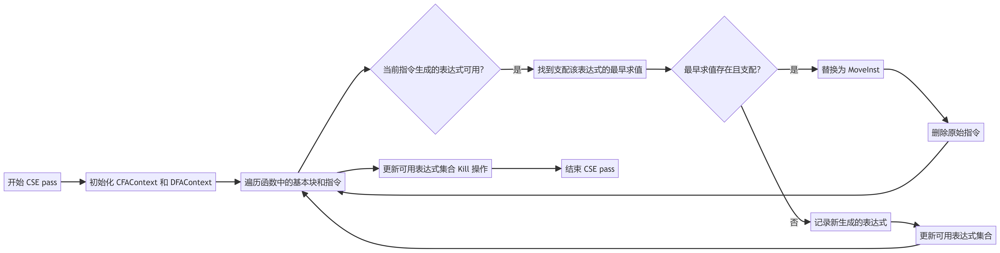

#### 2.3.2.7 函数内联

> sysy-compiler/src/midend/transforms/FuncInline

在函数调用的过程中会存在很多开销，通过将函数调用直接替换为函数体，我们减少了调用开销并且实现了性能的提升。然而，函数内联也需要在代码膨胀和性能提升之间进行权衡。我们在编译过程中实现了函数内联，减少调用开销并且便于后续的其他优化。

#### 2.3.2.8 循环不变代码移动

> sysy-compiler/src/midend/transforms/LICM

由于代码超过百分之90的运行时间都消耗在循环上，所以我们做了循环不变代码移动，将循环中的不变代码提升到循环的pre-header节点中，从而大大减少了循环中的重复计算。

假设有如下代码：

```c++
for (int i = 0; i < n; i++) {
    x = y + z;
    a[i] = 6 * i + x * x;
}
```

其中`x = y + z`与`x * x`这两步运算是循环不变的，会在优化中被移出循环体之外。经LICM优化后的代码为：

```c++
x = y + z;
t1 = x * x;
for (int i = 0; i < n; i++) {
    a[i] = 6 * i + t1;
}
```

#### 2.3.2.9 指令合并

> sysy-compiler/src/midend/transforms/InstCombine

指令组合优化是一个通过合并函数中可以简化的算术运算指令来减少冗余计算的过程。具体来说，本 pass 会递归地分析函数中的算术指令，识别并合并那些可以进一步简化的运算。例如，当连续的加法或乘法操作可以组合成单一的操作时，InstCombine 会将这些操作合并为一个新的指令，从而减少指令数量，优化执行路径。与常量折叠和复制传播相结合，指令组合能够显著提高代码的执行效率，特别是在涉及大量运算的场景中。

#### 2.3.2.10 循环强度削减

> sysy-compiler/src/midend/transforms/LoopStrengthReduce

循环强度削减旨在通过将复杂的算术运算替换为更简单、效率更高的运算来提升程序的执行性能。先分析循环中的归纳变量，并将乘除法等强度较高的运算替换为加减法等强度较低的运算，以减少循环体内的计算开销。通过递归处理归纳变量的依赖关系，并在循环预处理阶段预计算出变量的初始值和步长，循环强度削减能够显著降低循环中的运算复杂度，优化程序的运行效率。

#### 2.3.2.11 存储指令传播

> sysy-compiler/src/midend/transforms/StoreProg

由于访存操作（Load和Store）在计算机体系中是非常耗时的操作，因此消除掉多余的Store就显得尤为重要。StoreProg旨在减少不必要的内存加载操作，从而提高代码的执行效率。本 pass 在分析过程中，会对每一个加载指令（`LoadInst`）进行检查，利用数据流分析来确定哪些存储指令（`StoreInst`）直接定义了内存中的值。如果在某个加载指令处唯一可达的存储指令已知，那么加载指令可以被替换为一个简单的寄存器移动指令，从而避免不必要的内存访问。通过这种方法，存储指令传播减少了冗余的内存操作，使得程序运行更加高效。

具体流程如下图：


## 2.4 后端

### 2.4.1 指令选择

先将 IR 线性化（基本块按 DFS 序、指令按拓扑序排列），再依次对 IR 指令进行 RISC-V 指令的选择。对于绝大部分运算指令，主要需要分类讨论左、右操作数分别是否为立即数，以根据 RISC-V 指令集进行适当的指令选择；对于浮点立即数，我们设计了专门的方法用来生成对应的 `li` 整型操作数并用 `fmv.s.x` 转浮点。

在初步的指令选择后，每个 IR 变量会在目标代码中体现为其对应的虚拟寄存器。接下来，在寄存器分配环节中，这些虚拟寄存器将被指定物理寄存器（分配寄存器）或被溢出（分配栈空间）。

### 2.4.2 寄存器分配

我们使用线性扫描方法进行寄存器分配。利用中端的数据流分析结果，我们得到每个基本块入口和出口处的活跃变量集，将其映射到虚拟寄存器，并通过一趟线性遍历得到每个虚拟寄存器的活跃区间。基于这些活跃区间信息，我们进行一趟线性扫描，即可为所有虚拟寄存器分配对应的寄存器或栈空间。

对于溢出的变量，需要更新它们的取值和赋值指令，将其中的对应位置替换成临时寄存器，并在前面增加必要的 load 指令，在后面增加必要的 store 指令。

### 2.4.3 栈分配

我们为每个函数维护一个栈帧，存放所有内存变量（包括数组）、保存的程序现场、溢出的函数参数等。每次需要分配栈时，调用栈帧对应的分配函数，即可更新并得到该次分配的相对（这里说的是相对于对应的栈分配类型的顶部）offset 值。完成所有分配后，则可以计算得到整体的栈帧大小和绝对（这里说的是相对于 `s0` 或 `sp`）offset 值。此前的相对 offset 保存在虚拟寄存器中。

### 2.4.4 函数调用

函数传参可能会用到 `a0`~`a7`（整型/指针参数）、`fa0`~`fa7`（浮点参数）寄存器，当这些寄存器不够用时，多余的参数会溢出到栈帧中，这意味着调用者需要在低地址多分配一些栈空间用来给它调用的函数传递参数。由于调用者的 `sp` 等于被调用者的 `s0`，参数可以在分配栈空间时立即得到正确的 offset。SysY 函数的返回值类型可能为 int、float、void，故函数的返回值可能会保存在 `a0`、`fa0` 寄存器中，需要及时赋值给保存返回值的变量对应的寄存器。

在函数调用时，程序现场保存和恢复是一个复杂但必须处理的问题。根据 RISC-V 的约定，一部分寄存器由调用者保存，在传参之前压入栈中，处理完返回值后弹出栈；另一部分由被调用者保存，在进入函数时压入栈中，退出时弹出栈。传参需要保证参数寄存器的赋值是互不干扰的，为了防止 `(mv a0, a1; mv a1, a0)` 等情况，可以利用栈来间接传递；`call` 指令可能会改变返回值寄存器的值，也需要考虑。一个简单粗暴的方案是，调用者每次调用函数前直接将当前函数取过值的所有 caller-saved 寄存器都保存起来，完成返回值处理后把除了返回值寄存器之外的其他寄存器弹栈；而一个优化的方案是，考虑到只有对应位置活跃的寄存器有必要保存，所以只保存那些寄存器，这只需要在全局数据流分析结果的基础上一趟简单快速的局部活跃变量分析即可。

### 2.5.5 窥孔优化

窥孔优化利用一个滑动窗口，对相邻的数条指令做可能的替换，让汇编代码更简洁高效。

# 3. 运行时库

## 3.1 运行时库编译

### 将 sylib.c 和 sylib.h 编译链接为 libsysy.a

```shell
、  cv64-linux-gnu-gcc -Wall -c sylib.c -o sylib.o
riscv64-linux-gnu-ar cr libsysy.a sylib.o
```

### 将运行时库调用 getint.sy 进行编译、链接

-   getint.sy

```c
int a;
int main()
{
    a=getint();
    return a;
}
```

-   getint.s

```c
    .text
    .section .bss, "aw", @nobits
    .globl a
    .type a, @object
    .size a, 4
a:
    .space 4
    .data
    .text
    .globl main
    .type main, @function
main:
    sd fp, -8(sp)
    ori fp, sp, 0
    addi sp, sp, -32
    sd ra, -16(fp)
main_label_entry:
    call getint
    lla t6, a
    sw a0, 0(t6)
    lla t6, a
    lw a0, 0(t6)
main_exit:
    ld ra, -16(fp)
    ori sp, fp, 0
    ld fp, -8(sp)
    jr ra
```

-   编译

```shell
compiler -S -o getint.s getint.sy
```

-   汇编并链接运行时库

```shell
riscv64-linux-gnu-gcc getint.s -o getint.bin -Lsysy_runtime -lsysy
```

-   运行

```shell
(base) root@ZeroRegister:/home/zeroregister/CompilerCompetition/sysy-compiler/test_cases# qemu-riscv64 getint.bin
123
TOTAL: 0H-0M-0S-0us
(base) root@ZeroRegister:/home/zeroregister/CompilerCompetition/sysy-compiler/test_cases# echo $?
123
```

# 4. 环境配置

在配置开发和测试环境时，我们遇到了很多问题，以下汇总解决方法。

## 4.1 ANTLR4 环境配置和构建方法

### 4.1.1 配置 ANTLR 4.12.0 的 Java 库

安装 antlr4 4.12.0 JAR 包：

```shell
# 安装 jdk
sudo apt-get install openjdk-17-jre-headless

# 安装 antlr4
cd /usr/local/lib
wget https://www.antlr.org/download/antlr-4.12.0-complete.jar
export CLASSPATH=".:/usr/local/lib/antlr-4.12.0-complete.jar:$CLASSPATH"

# 配置别名
alias antlr4='java -jar /usr/local/lib/antlr-4.12.0-complete.jar'
alias grun='java org.antlr.v4.gui.TestRig'
```

为方便使用，在 `.bashrc` 里面添加后三行：

```shell
vim ~/.bashrc
export CLASSPATH=".:/usr/local/lib/antlr-4.12.0-complete.jar:$CLASSPATH"
alias antlr4='java -jar /usr/local/lib/antlr-4.12.0-complete.jar'
alias grun='java org.antlr.v4.gui.TestRig'
```

使 `bashrc` 生效

```shell
source ~/bashrc
```

### 4.1.2 配置 ANTLR 4.12.0 对应的 C++ 的运行时环境

去官网找 C++ 的 runtime library 源码，然后自己编译即可。

```shell
wget https://www.antlr.org/download/antlr4-cpp-runtime-4.12.0-source.zip
unzip antlr4-cpp-runtime-4.12.0-source.zip -d antlr4-cpp-runtime-4.12.0

# 开始编译
cd antlr4-cpp-runtime-4.12.0/
mkdir build && mkdir run && cd build
cmake ..
make install DESTDIR=../run

# 把生成的文件放在系统文件中
cd ../run/usr/local/include
sudo cp -r antlr4-runtime/* /usr/local/include
cd ../lib
sudo cp -r * /usr/local/lib
sudo ldconfig
```

### 4.1.3 BaseVisitor 等文件生成

使用 Antlr4 命令生成 Parser、Lexer、BaseVisitor 等文件。

```shell
antlr4 Sysy.g4 -Dlanguage=Cpp -no-listener -visitor -o generated/
```

## 4.2 CMake

 在评测机评测的时候是无法使用 CMake 的，但是本地使用 Wsl+Vscode+CMkake 进行开发就很方便。所以需要自行配置 CMake 来编译整个项目。

## 4.3 链接

[官方仓库](https://gitlab.eduxiji.net/csc1/nscscc/compiler2024)中的运行时库 libsysy.a 在本地无法链接，因此我们根据 libsysy.h 和 libsysy.cpp 文件自己编译了一分 libsysy.a 静态链接库文件。

# 5. 评测

## 5.1 评测

我们编写了 Python 脚本（[utils/evaluation/evaluator.py](utils/evaluation/evaluator.py)）进行本地的评测。

起初，本地评测成功，但上传到评测机时却出现了整体 CE（编译错误）的情况。后面经排查，是由于我们的仓库中含有其它语言的代码文件，如 `.c` 和 `.java` 后缀的文件，而这些后缀会使云端评测程序认为我们是 C 或 Java 项目。所以想要在评测机中取得有效成绩，需要删除掉仓库中所有其他语言的代码。

可以参照[官方仓库](https://gitlab.eduxiji.net/csc1/nscscc/compiler2024)中的 Compile.java 评测脚本（不过，该文件疑似过时）。

本地可以使用 compiler->riscv64-linux-gnu-gcc->qemu-riscv64 工具链进行评测。具体下载方法见互联网，这里以 `getint` 为例，使用方法如下：

-   编译

```shell
compiler -S -o path/to/getint.s path/to/getint.sy
```

-   汇编并链接运行时库

```shell
riscv64-linux-gnu-gcc path/to/getint.s -o path/to/getint.bin -Lsysy_runtime -lsysy
```

-   运行

```shell
$ qemu-riscv64 path/to/getint.bin
123
$ echo $?
123
```

## 5.2 数据分析与可视化

### 5.2.1 数据采集


我们编写了脚本`bar_score` `pie_score` 来量化以及可视化我们的编译器性能。我们将我们的编译器和GCC -O1和GCC -O2进行了多方面对比，包括编译时间、运行时间等，并且绘制了柱状图和饼图进行对比展示。

### 5.2.2 数据展示

**编译时间展示：**

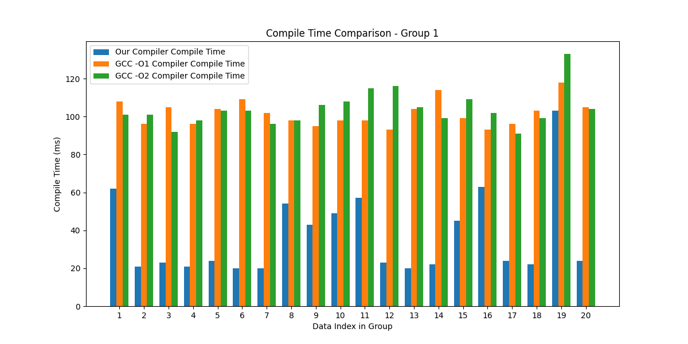

可以看到，在功能测试这些简单的用例上，我们的编译器由于Pass数量少于GCC，所以我们的编译器编译时间较短，编译较快。

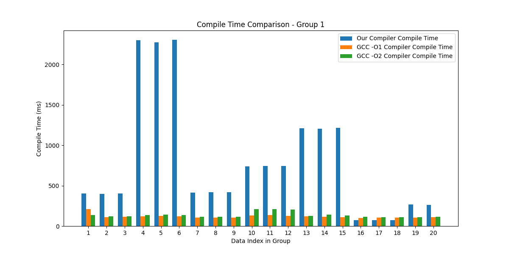

但在情况更复杂、循环嵌套更多、数组访问数量更多的某些用例中，我们的编译器由于某些Pass并不是最优的算法，导致会出现编译时间较长的情况。

**运行时间展示：**

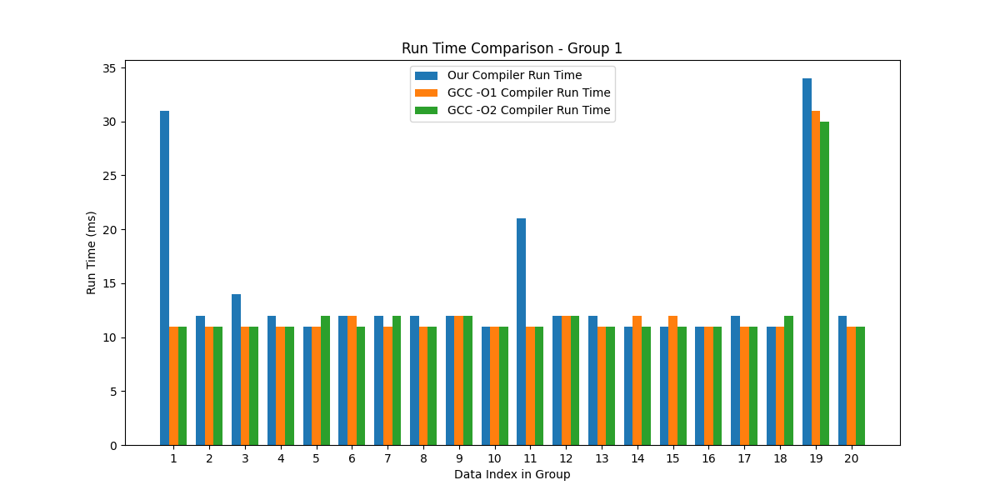

由于功能用例较为简单，因此我们的编译器基本持平GCC，甚至有快于GCC的情况。

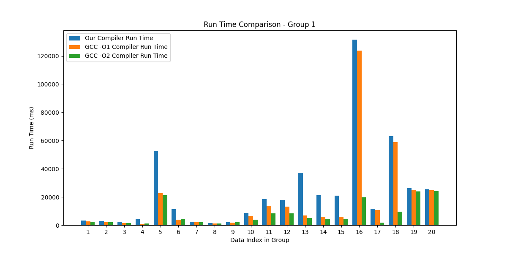

在性能用例中，我们的编译器性能和GCC -O1较为接近，但遇到某些特定复杂用例（比如多嵌套循环）GCC -O2会大幅领先我们的编译器和GCC -O1。这当然也可以理解，毕竟GCC经过多年迭代，优于我们的编译器也在情理之中。

### 5.2.3 性能分数计算

我们统计了performance中每个用例中我们的编译器以及GCC编译器的运行时间，并且用如下算法计算出每个用例的score
$$
score\_i=\frac{GCC\_compile\_time\_i}{Our\_compile\_time\_i}*100
$$


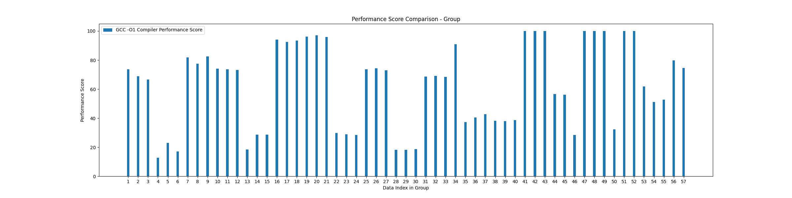

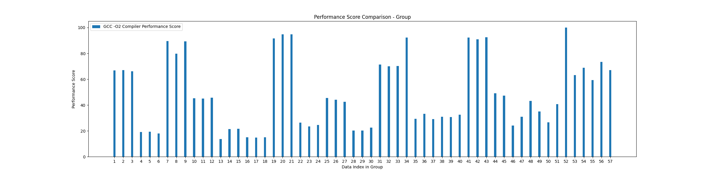

得到每一个用例的分数之后，我们使用算术平均来计算出相比GCC -O1和GCC -O2的平均分数，其中m为性能用例总数，为57个
$$
mean\_score=\frac{\sum^m_iscore_i}{m}
$$


计算得到相比于GCC -O1我们的编译器性能为
$$
mean\_score_{gcc\space o1} =  62.68
$$
计算得到相比于GCC -O2我们的编译器性能为
$$
mean\_score_{gcc\space o2} = 48.55
$$
由此图表及计算结果可得，我们的编译器已经实现了GCC的部分性能，在某些用例上面我们的性能甚至超过了GCC

### 5.2.4 总体统计

我们还绘制了两个饼图来直观展示对于GCC -O1和GCC -O2，我们的编译器处于GCC的性能区间的比例。

具体算法为
$$
score\_i=\frac{GCC\_compile\_time\_i}{Our\_compile\_time\_i}*100
$$
我们统计了$score\_i$在各个区间的比例，并绘制如下两个饼图。


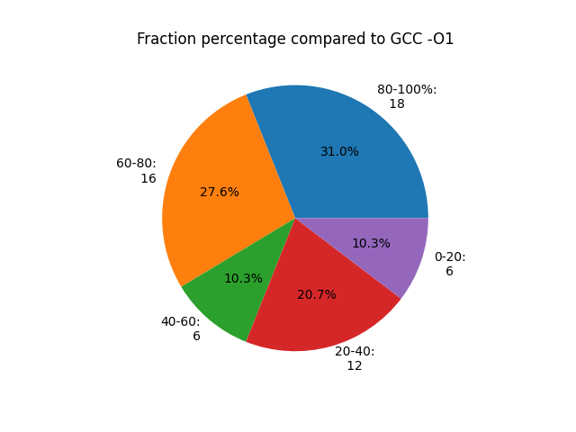

相比于GCC -O1，我们的大部分用例（40/58）都可以达到百分之40以上的性能，甚至有（18/58）个用例基本和GCC -O1持平或超越。

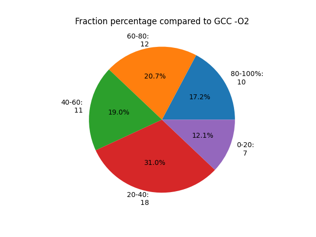

相比于GCC -O2，我们的部分用例（43/58）可以达到百分之40以上的性能，但经过对比可明显看出GCC -O2确实实力强劲，在相当一部分用例中的性能超过了我们的编译器以及GCC -O1。

# 6. 总结

本项目围绕 SysY 语言编译器展开，采用前端、中端、后端三层架构，前端使用 ANTLR4 构建语法分析器并设计文法规则生成 AST；中端参考 LLVM 设计 IR，进行多种优化提升代码质量；后端实现指令选择、寄存器分配等功能。同时，项目涉及运行时库编译、环境配置、评测及数据分析等工作，通过与 GCC -O1 和 GCC -O2 对比，在功能测试用例上编译时间有优势，运行时间基本持平或更快，性能用例中与 GCC -O1 接近，虽整体不及 GCC -O2，但已实现部分性能且在部分用例中表现出色，开发过程中还解决了环境配置等诸多问题，如 ANTLR4 环境配置与构建、CMake 使用及链接问题等，通过编写脚本进行本地评测及数据分析可视化展示编译器性能。

在本项目中，我们收获颇丰。我们不仅熟练掌握了编译器开发从前端到后端的整套流程，包括使用 ANTLR4 构建语法分析器、设计中间代码结构并实施多种优化，以及完成后端指令选择等操作，还学会了根据硬件平台特性（如 RISC - V 指令集）进行针对性设计。同时，在解决环境配置等一系列问题的过程中，增强了问题解决能力，并且通过与 GCC 的对比评测及数据分析，深入了解了编译器性能表现，明确了优化方向，为未来编译器的进一步改进和在相关领域的应用奠定了坚实基础，极大提升了我们在系统开发、性能优化和技术实践等多方面的综合能力。

